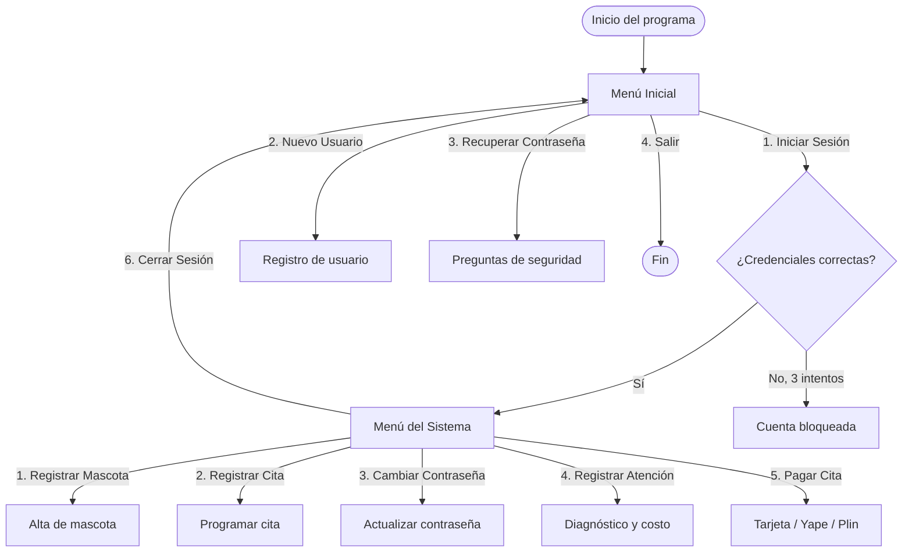

<div align="center">

```
      /\_/\   __ ____  ___    _ __ __     / \__
     ( o.o ) / |/ (_) (_)|   / /__/ /_   (    @\___
      > ^ <  /    / / / /|  / / _  __/    /         O
     / /  /  /_/_/ /_/ |__/ __/ /_       /   (_____/
    /_/                                /_____/  U
```

# 🐾 Intranet MilyVet

### Sistema de gestión veterinaria desarrollado en Python

*Proyecto académico — Fundamentos de Programación 1 · UPC*

<br/>


[Ver código fuente](https://github.com/PrintToCode/Intranet-MilyVet/blob/main/Intranet_Milyvet.py) · [Reportar un problema](https://github.com/PrintToCode/Intranet-MilyVet/issues)

</div>

<br/>

## 📌 Tabla de contenido

- [🩺 Sobre el proyecto](#-sobre-el-proyecto)
- [🎯 Situación problemática](#-situación-problemática)
- [✨ Funcionalidades](#-funcionalidades)
- [🧩 Módulos del sistema](#-módulos-del-sistema)
- [🏗️ Arquitectura y modelo de datos](#️-arquitectura-y-modelo-de-datos)
- [🛠️ Tecnologías utilizadas](#️-tecnologías-utilizadas)
- [🚀 Instalación y ejecución](#-instalación-y-ejecución)
- [🖥️ Flujo de navegación](#️-flujo-de-navegación)
- [🔐 Reglas de negocio destacadas](#-reglas-de-negocio-destacadas)
- [📂 Estructura del código](#-estructura-del-código)
- [🗺️ Roadmap](#️-roadmap)
- [👥 Equipo de desarrollo](#-equipo-de-desarrollo)
- [📄 Licencia y contexto académico](#-licencia-y-contexto-académico)

<br/>

## 🩺 Sobre el proyecto

**MilyVet** es una veterinaria que gestionaba manualmente el registro de clientes, mascotas y citas, lo que generaba demoras, pérdida de información y dificultades en la atención al público.

**Intranet MilyVet** es la solución propuesta: un sistema de consola (CLI) desarrollado en **Python**, que digitaliza los procesos clave de la veterinaria —autenticación de usuarios, registro de mascotas, programación de citas, atención médica y pagos— aplicando estructuras secuenciales, selectivas, repetitivas, arreglos y cadenas.

> 💡 Este proyecto forma parte del Trabajo Bibliográfico 2 (TB2) del curso **Fundamentos de Programación 1**, y sustenta el logro del **Student Outcome ABET 2 — Diseño en Ingeniería**.

<br/>

## 🎯 Situación problemática

| ❌ Antes (proceso manual) | ✅ Ahora (Intranet MilyVet) |
|---|---|
| Registro de clientes y mascotas en papel | Registro digital validado con reglas de negocio |
| Citas duplicadas o mal gestionadas | Máximo 1 cita por día por mascota, con prioridad a emergencias |
| Contraseñas y accesos sin control | Contraseñas seguras, bloqueo tras intentos fallidos y recuperación con preguntas de seguridad |
| Pagos sin trazabilidad | Módulo de pagos con tarjeta de crédito o Yape/Plin y código de transacción |
| Información dispersa | Historial centralizado de mascotas, atenciones y citas |

<br/>

## ✨ Funcionalidades

<table>
<tr>
<td width="50%" valign="top">

### 🔓 Acceso y seguridad
- Inicio de sesión con validación de correo y contraseña
- Registro de nuevos usuarios
- Bloqueo automático tras 3 intentos fallidos
- Recuperación de contraseña con preguntas de seguridad
- Cambio de contraseña con reglas de complejidad
- Contraseñas ocultas al escribir (`getpass`)

</td>
<td width="50%" valign="top">

### 🐶 Gestión veterinaria
- Registro de mascotas (con ID autogenerado por especie)
- Programación de citas médicas
- Registro de atención clínica (solo personal veterinario)
- Módulo de pagos (tarjeta o Yape/Plin)
- Resumen diario de atenciones e ingresos
- Menú de bienvenida y arte ASCII personalizado 🐾

</td>
</tr>
</table>

<br/>

## 🧩 Módulos del sistema

```
MENÚ INICIAL
 ├── 1. Iniciar Sesión
 ├── 2. Nuevo Usuario
 ├── 3. Recuperar Contraseña
 └── 4. Salir
       │
       ▼  (login correcto)
MENÚ DEL SISTEMA
 ├── 1. Registrar Mascota
 ├── 2. Registrar Cita
 ├── 3. Cambiar Contraseña
 ├── 4. Registrar Atención   🩺 (solo rol VET)
 ├── 5. Pagar Cita
 └── 6. Cerrar Sesión
```

| # | Módulo | Descripción breve |
|---|---|---|
| 1 | **Iniciar Sesión** | Valida credenciales; bloquea la cuenta tras 3 intentos fallidos |
| 2 | **Nuevo Usuario** | Registra usuarios validando correo único y contraseña segura |
| 3 | **Recuperar Contraseña** | Verifica 3 preguntas de seguridad antes de permitir el cambio |
| 4 | **Registrar Mascota** | Genera ID único por especie (`CAN`, `FEL`, `AVE`, `CON`, `OTR`) |
| 5 | **Registrar Cita** | Restringe a 1 cita/día por mascota y prioriza emergencias |
| 6 | **Cambiar Contraseña** | Actualiza la contraseña validando su complejidad |
| 7 | **Registrar Atención** | Módulo exclusivo del rol `VET`; genera diagnóstico y costo |
| 8 | **Pagar Cita** | Procesa el pago vía tarjeta de crédito o Yape/Plin |
| 9 | **Cerrar Sesión** | Retorna al Menú Inicial |

<br/>

## 🏗️ Arquitectura y modelo de datos

El sistema simula una base de datos mediante **listas de objetos** en memoria, modelados con clases (POO):

| Clase | Atributos principales |
|---|---|
| `Usuario` | correo, contraseña, preguntas de seguridad, estado de bloqueo, rol (`USER` / `VET`) |
| `Mascota` | ID, correo del dueño, nombre, sexo, especie, raza, fecha de nacimiento, peso |
| `Cita` | ID de mascota, médico, especialidad, fecha, hora, estado, atendido |
| `Atencion` | ID de atención, mascota, motivo, diagnóstico, tratamiento, precio, fecha |
| `Pago` | mascota, médico, fecha, hora, método, monto, estado, código de pago |

```
tabla_usuarios     → lista de objetos Usuario
tabla_mascotas     → lista de objetos Mascota
tabla_citas        → lista de objetos Cita
tabla_atenciones   → lista de objetos Atencion
tabla_pagos        → lista de objetos Pago
tabla_medicos      → catálogo de médicos por especialidad
```

<br/>

## 🛠️ Tecnologías utilizadas

<div align="center">


</div>

| Herramienta | Uso en el proyecto |
|---|---|
| **Python 3.13** | Lenguaje principal — lógica de negocio y validaciones |
| **Visual Studio Code** | Entorno de desarrollo, depuración y control de versiones |
| **GitHub** | Repositorio central y control de versiones del código fuente |
| **Trello** | Gestión ágil del proyecto mediante Product Backlog (Kanban) |

**Módulos de la librería estándar de Python usados:** `os` · `getpass` · `re` · `datetime` · `random`

<br/>

## 🚀 Instalación y ejecución

### Requisitos previos
- Tener instalado **Python 3.13** o superior → [Descargar aquí](https://www.python.org/downloads/)

### Pasos

```bash
# 1. Clonar el repositorio
git clone https://github.com/PrintToCode/Intranet-MilyVet.git

# 2. Ingresar a la carpeta del proyecto
cd Intranet-MilyVet

# 3. Ejecutar el sistema
python Intranet_Milyvet.py
```

> 🐧 En Linux/Mac puede que necesites usar `python3` en lugar de `python`.

### 🔑 Usuario de prueba

| Correo | Contraseña | Rol |
|---|---|---|
| `luis.alberca.munive@gmail.com` | `clave123` | `VET` |

<br/>

## 🖥️ Flujo de navegación



<br/>

## 🔐 Reglas de negocio destacadas

- 🔒 La contraseña debe tener **mínimo 20 caracteres**, con mayúscula, minúscula, número y carácter especial.
- 🚫 Tras **3 intentos fallidos** de inicio de sesión, la cuenta se bloquea automáticamente.
- 📧 El correo se valida con expresiones regulares (`regex`) antes de continuar.
- 🐾 Cada mascota recibe un **ID único** según su especie (`CAN`, `FEL`, `AVE`, `CON`, `OTR`).
- 📅 Solo se permite **1 cita por día por mascota**, priorizando los casos de emergencia.
- 🩺 El módulo de **Registrar Atención** solo está disponible para usuarios con rol `VET`.
- 💳 Los pagos se procesan mediante **tarjeta de crédito** o **Yape / Plin**, generando un código de transacción.

<br/>

## 📂 Estructura del código

El proyecto se organiza en un único archivo (`Intranet_Milyvet.py`), dividido en bloques claramente delimitados:

```
├── Importar librerías
├── Construcción de la "BD" simulada (clases + datos de prueba)
├── Funciones de apoyo
│   ├── limpiar_pantalla()
│   ├── validar_contrasena()
│   ├── validar_correo()
│   ├── generar_id_mascota() / actualizar_contador_id()
│   ├── generar_id_atencion()
│   └── resumen_dia()
├── Funciones del Menú Inicial
│   ├── menu_inicial()
│   ├── iniciar_sesion()
│   ├── nuevo_usuario()
│   └── recuperar_contrasena()
└── Funciones del Menú del Sistema
    ├── menu_sistema()
    ├── registrar_mascota()
    ├── registrar_cita()
    ├── cambiar_contrasena()
    ├── registrar_atencion()
    └── pagar_cita()
```

<br/>

## 🗺️ Roadmap

- [ ] Migrar la "BD" simulada (listas en memoria) a una **base de datos real**
- [ ] Integrar una **pasarela de pagos certificada** (tarjeta / Yape / Plin)
- [ ] Desplegar el sistema en **AWS Lightsail**
- [ ] Implementar una interfaz gráfica o web sobre la lógica actual

<br/>

## 👥 Equipo de desarrollo

<div align="center">

| Integrante |
|---|
| Alberca Munive, Luis Enrico |
| Arévalo Villano, Jaime Manuel |
| Huamán Delgado, Dennis Daniel |
| Jaramillo Espinoza, Angela Ariana |
| Lobaton Reimundiz, Daniela Andrea |

**Tutor:** Maldonado Cuzcano, Erick Teodoro

</div>

📌 Gestión del proyecto: [Tablero de Trello](https://trello.com/invite/b/6a2f2d9bb9b3d21106e25fcf/ATTIaec532202b5146aeacc5c61087bda73dC9FC6CC8/sistema-veterinaria-milyvet)
📌 Diagrama de flujo completo: [Ver en Lucidchart](https://lucid.app/lucidchart/b0769c8c-e2a8-44f4-8c73-4b2c27c6e93a/view)

<br/>

## 📄 Licencia y contexto académico

Este proyecto fue desarrollado con **fines académicos e informativos** para el curso **1FIS0274 — Fundamentos de Programación 1**, Facultad de Ingeniería de Sistemas — **Universidad Peruana de Ciencias Aplicadas (UPC)**.

<div align="center">

🐶🐱 *Hecho con Python y mucho café por el equipo de MilyVet* 🐾

</div>
